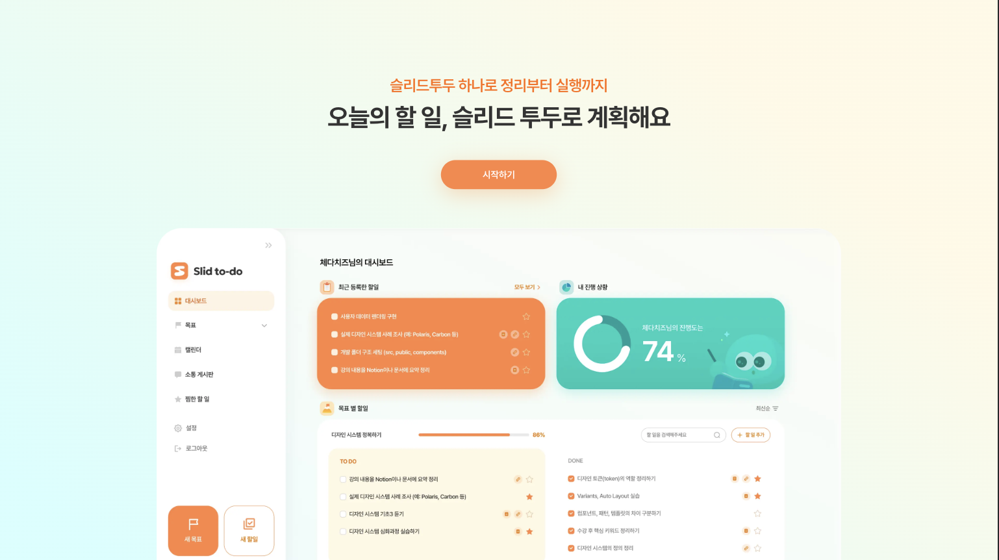
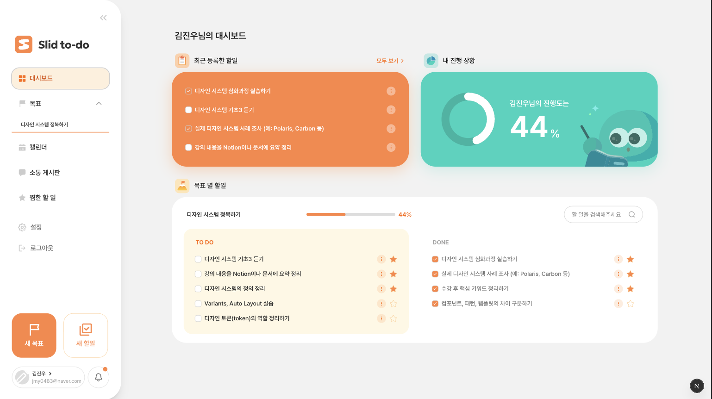
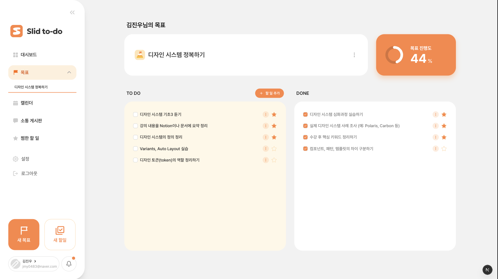
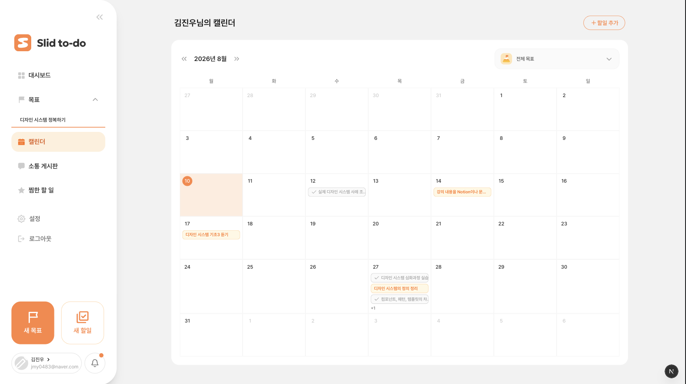
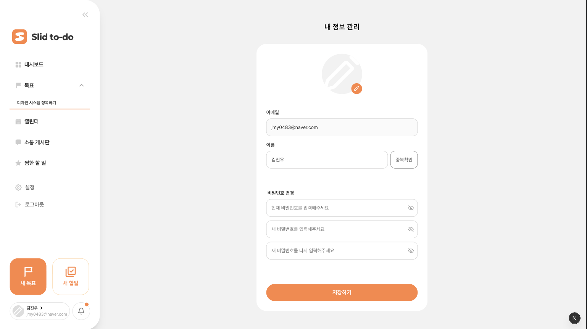

# 슬리드 투두 (Sleed Todo)



## ☑️ 슬리드 투두는 어떤 서비스인가요?

> 정리부터 실행까지, 목표 기반 할일 관리 서비스

- 유저가 다양한 콘텐츠(아티클, 강의 영상, 줌 미팅 일정, 강의 PDF 등)를 할일 목록으로 관리할 수 있는 서비스입니다.
- 학습 진도나 프로젝트 진행 상황을 대시보드로 보여줍니다.
- 각 할일에 대한 노트를 작성해 관리할 수 있습니다.

## 🚀 배포 링크

- 배포 사이트: https://fesi-15-todo-nine.vercel.app/
- 저장소: https://github.com/FESI-15/FESI-15-TODO
- 팀: D.P. (코드잇 프론트엔드 단기심화 15기 2팀)
- 진행 기간: 2026.07.10 ~ 2026.08.21

## ✨ 주요 기능

### 대시보드

최근 등록한 할일과 전체 진행도, 목표별 할일을 TO DO / DONE 칼럼으로 확인



### 목표(Goals) 관리

목표별 진행률과 할일을 TO DO / DONE 칼럼으로 관리



### 캘린더

월별 캘린더 뷰에서 일정 확인



### 마이페이지

닉네임 등 내 정보 조회/수정



### 그 외 기능

- **할일(Todo) 관리**: 할일 생성/수정/완료, 즐겨찾기, 완료 여부 필터링
- **커뮤니티**: 게시글 작성/수정, 댓글, 베스트 게시글 모아보기
- **알림**: 무한 스크롤로 알림 조회
- **인증**: 이메일/구글 OAuth 로그인, 인증 프록시로 보호 경로 접근 제어
- **다크 모드**: 라이트/다크 테마 전환

## 📚 기술 스택

| 분류                  | 항목                                                                                                                                                                                                                                                                                                                                    |
| --------------------- | --------------------------------------------------------------------------------------------------------------------------------------------------------------------------------------------------------------------------------------------------------------------------------------------------------------------------------------- |
| 언어                  |                                                                                                                                                                                                                                            |
| 프론트엔드 프레임워크 |                                                                                                                                                                     |
| 스타일링              |                                                                                                                                            |
| 상태 관리             |                                                                                                                                                                                   |
| 폼 / 검증             |                                                                                                                                                       |
| 애니메이션 / 에디터   |                                                                                                                                                                                     |
| API 통신              |                                                                                                                                                                                                                                                           |
| 패키지 매니저         |                                                                                                                                                                                                                                                                 |
| 코드 품질 도구        |                                                 |
| 테스트                |                                                                                                                                                   |
| 배포 및 CI/CD         |                                                                                                                                                |
| 협업 도구             |     |

## 👥 팀원

| 이름   | 역할              | GitHub                                         |
| ------ | ----------------- | ----------------------------------------------- |
| 임동현 | 프론트엔드 (팀장) | [@DHyeon98](https://github.com/DHyeon98)       |
| 장민영 | 프론트엔드        | [@minyeong123](https://github.com/minyeong123) |

## 📁 폴더 구조

```text
app/                # 라우팅
components/
  common/           # 2개 이상 컴포넌트에서 쓰이는 공통 컴포넌트
  layout/           # header, footer, nav 등 레이아웃 컴포넌트
  ui/               # shadcn/ui 기반 컴포넌트
  auth/             # 로그인/회원가입 전용 컴포넌트
  dashboard/        # 대시보드 전용 컴포넌트
  goals/            # 목표 전용 컴포넌트
  todos/            # 할일 전용 컴포넌트
  calendar/         # 캘린더 전용 컴포넌트
  community/        # 커뮤니티 전용 컴포넌트
  favorites/        # 즐겨찾기 전용 컴포넌트
  mypage/           # 마이페이지 전용 컴포넌트
  landing/          # 랜딩 페이지 전용 컴포넌트
hooks/              # 커스텀 훅
apis/               # API 요청 함수
providers/          # React Query, Motion 등 Provider
store/              # 전역 상태 (Zustand)
types/              # 타입 정의
constants/          # 상수
utils/              # 2곳 이상에서 쓰이는 유틸 함수
test/               # 테스트 유틸, mock
public/             # 정적 파일
```

## 📐 개발 컨벤션

### 커밋 컨벤션

| 타입       | 설명                           | 예시                                           |
| ---------- | ------------------------------ | ---------------------------------------------- |
| `feat`     | 새로운 기능 추가               | `feat: Todo 수정 기능 추가`                    |
| `fix`      | 버그 수정                      | `fix: 완료된 Todo가 다시 활성화되는 문제 수정` |
| `refactor` | 기능 변경 없이 코드 개선       | `refactor: API 호출 로직 분리`                 |
| `style`    | 코드 스타일 변경 (로직 변경 X) | `style: import 정렬`                           |
| `test`     | 테스트 코드                    | `test: 로그인 API 테스트 추가`                 |
| `docs`     | 문서 수정                      | `docs: 브랜치 전략 추가`                       |
| `chore`    | 설정, 패키지, 빌드             | `chore: React Query 설치`                      |

### 코드 스타일

- Prettier 필수
- 함수는 `const` 사용
- Props는 `interface` 사용
- 상수는 대문자 사용
- 컴포넌트는 `function` 사용

### Git 브랜치 전략

- `feature → main`
- main에 직접 push 금지, 무조건 feature 브랜치에서 작업
- PR은 최소 1명 리뷰 후 merge
- merge 전에 `npm run test` / `npm run type-check` 확인
